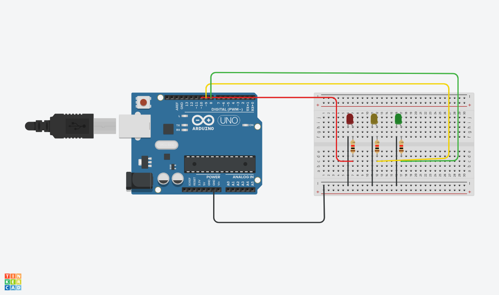

# Projetos de Arduino 🤖

Repositório criado para guardar os códigos de automação e circuitos desenvolvidos durante a faculdade.

## 📁 Projetos Incluídos

### 🚥 Semáforo Normal
Código e lógica de um semáforo de trânsito simples.

---

### 🚦 Semáforo Composto
Semáforo com múltiplas vias e sinalização de atenção.

---

### 🚶 Semáforo Composto com Pedestre
Semáforo integrado com controle de travessia para pedestres.

---

### 💡 LEDs Sequenciais
Controle e animação de LEDs piscando em sequência.

## 🛠️ Tecnologias e Ferramentas
* Arduino (C++)
* Tinkercad (Simulação dos circuitos)
